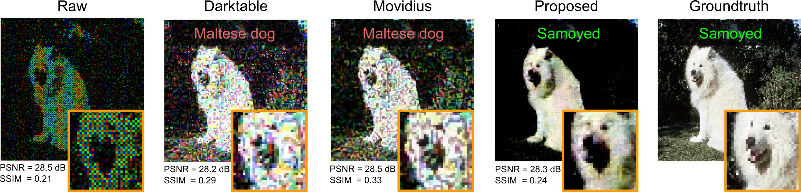
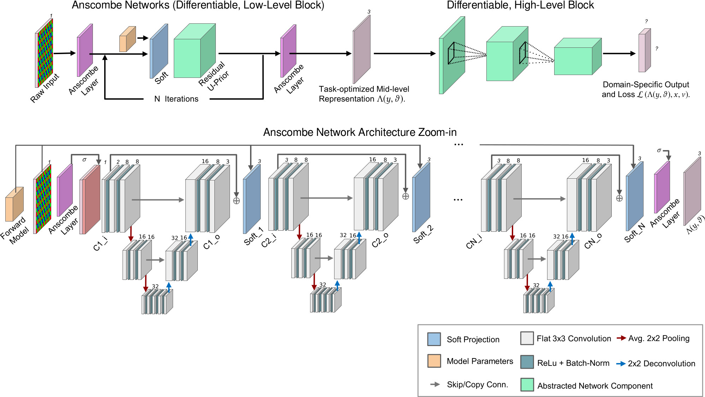

# Dirty Pixels: Towards End-to-End Image Processing and Perception
This repository contains the code for the paper 

**[Dirty Pixels: Towards End-to-End Image Processing and Perception][1]**  
[Steven Diamond][sd], [Vincent Sitzmann][vs], [Frank Julca-Aguilar][fj], [Stephen Boyd][sb], [Gordon Wetzstein][gw], [Felix Heide][fh]  
Transactions on Graphics, 2021 | To be presented at SIGGRAPH, 2021

<div align="center">
  
</div>

<br />

<div align="center">
  
  
</div>

## Installation
Requirements:
- Python 3.6
- Tensorflow (v1.12)
- Slim

Clone this repository:
```
git clone git@github.com:princeton-computational-imaging/DirtyPixels.git
```

## Running Experiments
We provide code and data and trained models to reproduce the main results presented at the paper, and instructions on how to use this project for further research:
- [EVALUATION_INSTRUCTIONS.md](EVALUATION_INSTRUCTIONS.md) provides instructions
on how to evaluate our proposed models and reproduce results of the paper.
- [TRAINING_INSTRUCTIONS.md](TRAINING_INSTRUCTIONS.md) gives instructions on how to train new models following our proposed approach.
- [ADD_NOISE_INSTRUCTIONS.md](ADD_NOISE_INSTRUCTIONS.md) explains how to simulate 
noisy raw images following the image formation model defined in the 
manuscript.

## Citation
If you find our work useful in your research, please cite:

```
@article{steven:dirtypixels2021,
  title={Dirty Pixels: Towards End-to-End Image Processing and Perception},
  author={Diamond, Steven and Sitzmann, Vincent and Julca-Aguilar, Frank and Boyd, Stephen and Wetzstein, Gordon and Heide, Felix},
  journal={ACM Transactions on Graphics (SIGGRAPH)},
  year={2021},
  publisher={ACM}
}
```

## License

This project is released under [MIT License](LICENSE).


[1]: https://arxiv.org/abs/1701.06487
[sd]: https://stevendiamond.me
[vs]: https://vsitzmann.github.io
[fj]: https://github.com/fjulca-aguilar 
[sb]: https://web.stanford.edu/~boyd/
[gw]: https://stanford.edu/~gordonwz/
[fh]: https://www.cs.princeton.edu/~fheide/

